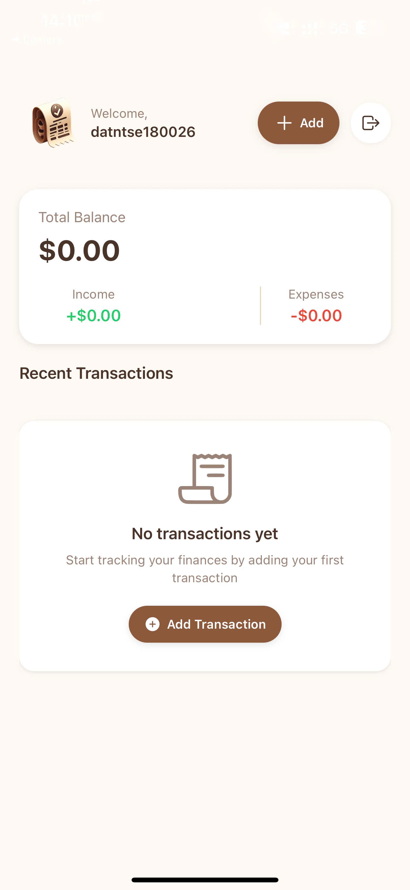
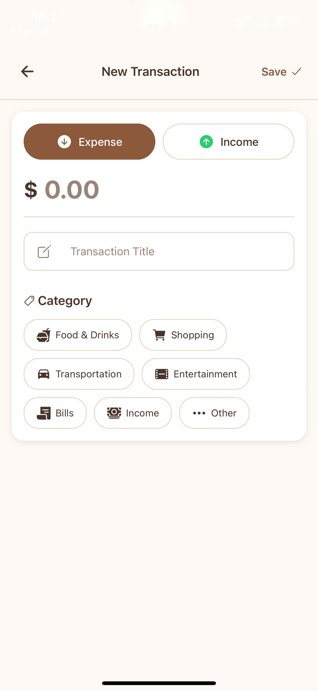

# 💰 Wallet - React Native Expense Tracker

A modern expense tracking mobile application built with React Native and Expo for learning purposes. Track your income, expenses, and manage your finances with an intuitive interface.

## 📱 Screenshots

<div align="center">
  
  
  
  
  
</div>

## 🚀 Features

- ✅ User Authentication (Clerk)
- ✅ Add Income/Expense Transactions
- ✅ Categorize Transactions
- ✅ Real-time Balance Summary
- ✅ Transaction History
- ✅ Delete Transactions
- ✅ Responsive UI Design
- ✅ Cross-platform (iOS/Android/Web)

## 🛠️ Tech Stack

**Frontend:**

- React Native
- Expo
- TypeScript
- Expo Router (File-based routing)
- Clerk (Authentication)

**Backend:**

- Node.js
- Express.js
- Neon Database (PostgreSQL)
- REST API

**Deployment:**

- Backend: Render.com
- Mobile: Expo Go / EAS Build

## 📂 Project Structure

```
mobile/
├── app/
│   ├── (auth)/          # Authentication screens
│   ├── (root)/          # Main app screens
│   └── _layout.tsx      # Root layout
├── components/          # Reusable components
├── hooks/              # Custom hooks
├── constants/          # App constants
├── assets/             # Images, fonts, styles
└── lib/                # Utilities

backend/
├── src/
│   ├── routes/         # API routes
│   ├── config/         # Database config
│   └── middleware/     # Custom middleware
```

## 🚀 Getting Started

### Prerequisites

- Node.js (v18 or higher)
- npm or yarn
- Expo CLI
- Expo Go app (for testing)

### Installation

1. **Clone the repository**

   ```bash
   git clone <repository-url>
   cd Wallet
   ```

2. **Setup Backend**

   ```bash
   cd backend
   npm install
   cp .env.example .env
   # Add your database URL and other environment variables
   npm run dev
   ```

3. **Setup Mobile App**

   ```bash
   cd mobile
   npm install
   cp .env.example .env
   # Add your Clerk publishable key
   npx expo start
   ```

4. **Scan QR code** with Expo Go app to run on your device

## 🔧 Environment Variables

**Backend (.env):**

```
DATABASE_URL=your_neon_database_url
NODE_ENV=development
```

**Mobile (.env):**

```
EXPO_PUBLIC_CLERK_PUBLISHABLE_KEY=your_clerk_key
```

## 📱 Usage

1. **Sign Up/Sign In** with your email
2. **Add transactions** by tapping the "+" button
3. **Choose category** (Food, Transportation, Income, etc.)
4. **View balance summary** on the home screen
5. **Manage transactions** with swipe-to-delete

## 🎯 Learning Objectives

This project demonstrates:

- React Native development with TypeScript
- State management with custom hooks
- API integration and data fetching
- User authentication implementation
- Database design and operations
- Mobile app deployment strategies

## 🤝 Contributing

This is a learning project. Feel free to fork and experiment!

## 📝 License

This project is for educational purposes only.

---

Built with ❤️ using React Native & Expo
